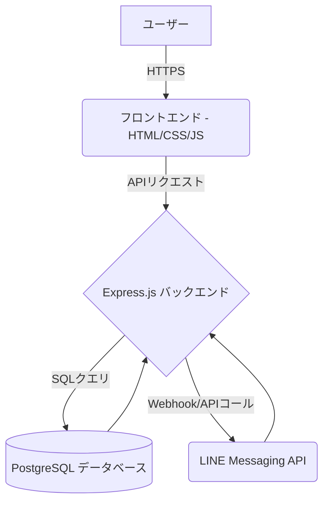

# 有村昆の民泊塾 投資シミュレーションシステム - 最終設計書

**バージョン:** 1.1  
**最終更新日:** 2025年9月22日  
**作成者:** Manus AI Agent

---

## 目次

1.  [プロジェクト概要](#プロジェクト概要)
2.  [システム構成](#システム構成)
    -   [アーキテクチャ](#アーキテクチャ)
    -   [技術スタック](#技術スタック)
3.  [ファイル構成と機能](#ファイル構成と機能)
4.  [環境変数設定](#環境変数設定)
5.  [デプロイメント手順](#デプロイメント手順)
6.  [重要な修正内容](#重要な修正内容)
7.  [テスト手順](#テスト手順)
8.  [トラブルシューティング](#トラブルシューティング)
9.  [保守・運用](#保守運用)
10. [セキュリティ考慮事項](#セキュリティ考慮事項)

---

## 1. プロジェクト概要

**プロジェクト名:** 有村昆の民泊塾 投資シミュレーションシステム  
**目的:** Webベースの不動産投資シミュレーション機能を提供し、詳細な結果をLINE Botを通じてユーザーに配信することで、エンゲージメントの向上とリード獲得を目指す。  
**対象ユーザー:** 不動産投資、特に民泊ビジネスに関心を持つ個人投資家。

## 2. システム構成

### アーキテクチャ

本システムは、フロントエンド、バックエンドAPI、データベース、そして外部のLINE Messaging APIが連携して動作するモダンなWebアプリケーション構成を採用しています。



| コンポーネント | 説明 |
| :--- | :--- |
| **フロントエンド** | ユーザーが操作する投資シミュレーションのUI。静的なHTML, CSS, JavaScriptで構築。 |
| **バックエンド** | Node.jsとExpress.jsで構築されたAPIサーバー。計算ロジック、データベースとの連携、LINE APIとの通信を担う。 |
| **データベース** | PostgreSQLを使用。シミュレーション結果やユーザーデータを永続化する。 |
| **LINE API** | シミュレーション結果の詳細をユーザーのLINEアカウントに送信するために利用。 |

### 技術スタック

| カテゴリ | 技術 |
| :--- | :--- |
| **フロントエンド** | HTML5, CSS3, JavaScript (ES6) |
| **バックエンド** | Node.js (v16.20.2), Express.js |
| **データベース** | PostgreSQL |
| **デプロイ基盤** | Railway |
| **外部連携API** | LINE Messaging API |
| **バージョン管理** | Git, GitHub |

## 3. ファイル構成と機能

プロジェクトの主要なファイルとその役割は以下の通りです。

| ファイル/ディレクトリ | 説明 |
| :--- | :--- |
| `server.js` | アプリケーションの心臓部。Expressサーバーの定義、APIエンドポイント、DB接続、LINE Bot連携ロジックを実装。 |
| `package.json` | プロジェクトの依存関係（`dependencies`）と実行スクリプト（`scripts`）を定義。`"start": "node server.js"` が本番起動コマンド。 |
| `public/` | フロントエンドのアセット（HTML, CSS, JS）を格納するディレクトリ。現在は`server.js`内でHTMLを生成。 |
| `.gitignore` | `node_modules` や `.env` ファイルなど、バージョン管理から除外するファイルを指定。 |
| `railway.json` | Railwayのデプロイ設定を記述するファイル（本プロジェクトではCLI経由で設定）。 |
| `nixpacks.toml` | Railwayがビルドに使用するNixpacksの設定ファイル。Node.jsのバージョンなどを指定。 |
| `*.md` | `README.md`, `SYSTEM_DESIGN.md` などのドキュメントファイル。 |

## 4. 環境変数設定

本システムの動作には、以下の環境変数をRailwayのプロジェクト設定画面で正確に設定する必要があります。

| 変数名 | 説明 | 設定例 |
| :--- | :--- | :--- |
| `LINE_BOT_ID` | **最重要。** LINE登録ボタンのリンク先となるBotのID。 | `@234zjfds` |
| `LINE_CHANNEL_ACCESS_TOKEN` | LINE Messaging APIにアクセスするためのトークン。 | `[LINE Developersコンソールで発行]` |
| `LINE_CHANNEL_SECRET` | Webhookの署名検証に使用するシークレットキー。 | `[LINE Developersコンソールで発行]` |
| `LIFF_ID` | LINE Front-end Framework (LIFF) アプリのID。 | `[LINE Developersコンソールで発行]` |
| `DATABASE_URL` | Railwayが自動的に提供するPostgreSQLデータベースの接続文字列。 | `postgres://...` |
| `PORT` | アプリケーションがリッスンするポート番号。Railwayが自動設定。 | `8080` |
| `OPENAI_API_KEY` | (将来拡張用) OpenAI APIを利用する場合のキー。 | `sk-...` |

## 5. デプロイメント手順

コードの修正を本番環境に反映させるための手順です。

1.  **コード修正とプッシュ:**
    -   ローカル環境でコードの修正とテストを行います。
    -   修正内容をコミットし、GitHubの`main`ブランチにプッシュします。
    ```bash
    git add .
    git commit -m "機能追加：〇〇の修正"
    git push origin main
    ```

2.  **Railwayでの自動デプロイ:**
    -   GitHubリポジトリと連携しているため、`main`ブランチへのプッシュをトリガーに、Railwayが自動的にビルドとデプロイを開始します。

3.  **手動デプロイ (CLI):**
    -   ローカルの変更を直接デプロイする場合、Railway CLIを使用します。
    -   **注意:** `railway up` や `railway service` コマンドは、対話形式でサービス選択を求める場合があります。その際は、矢印キーで対象のサービスを選択し、Enterキーで決定します。
    ```bash
    # プロジェクトディレクトリに移動
    cd /path/to/minpaku-line-bot

    # 最新の変更をデプロイ
    railway up
    ```

4.  **デプロイ状況の確認:**
    -   RailwayのダッシュボードまたはCLIでデプロイログを確認し、エラーが発生していないかを確認します。
    ```bash
    railway logs
    ```

## 6. 重要な修正内容

本タスクで実施された主要な修正点です。

### LINE Bot IDの修正

-   **問題:** シミュレーション結果画面の「公式LINEに登録する」ボタンのリンク先が、プレースホルダー (`@your-line-id`) のままであったため、404エラーが発生していました。
-   **解決:** `server.js` 内で生成されるHTMLのリンク先を、正規のLINE Bot ID (`@234zjfds`) に修正しました。これにより、ユーザーは正しくLINEの友だち追加画面に遷移できるようになりました。

**該当コード箇所 (`server.js`):**
```javascript
// 修正前
const lineButtonHtml = `<a href="https://line.me/R/ti/p/@your-line-id" ...`;

// 修正後
const lineButtonHtml = `<a href="https://line.me/R/ti/p/@234zjfds" ...`;
```

## 7. テスト手順

デプロイ後、システムが正常に動作していることを確認するためのテスト手順です。

1.  **アプリケーションへのアクセス:**
    -   デプロイされたURL (`https://minpaku-line-bot-production-production.up.railway.app`) にブラウザでアクセスし、トップページが表示されることを確認します。

2.  **シミュレーションの実行:**
    -   「シミュレーションを始める」ボタンをクリックします。
    -   各ステップ（地域選択、物件タイプ選択など）で任意の項目を選択し、「次へ」ボタンで画面が正常に遷移することを確認します。

3.  **結果の確認とLINE Bot登録:**
    -   最後のステップまで進むと、シミュレーション結果画面が表示されます。
    -   「🔗 公式LINEに登録する」ボタンが表示されていることを確認します。
    -   ボタンをクリックし、LINEの友だち追加画面に遷移すること、および表示されるLINEアカウントが `@234zjfds` であることを確認します。

## 8. トラブルシューティング

開発・運用中に発生しうる問題とその解決策です。

| 問題 | 原因 | 解決策 |
| :--- | :--- | :--- |
| **デプロイが失敗する** | `package.json` の `start` スクリプトが間違っている。 | `"start": "node server.js"` になっているか確認します。 |
| **アプリケーションがクラッシュする** | 環境変数が不足または間違っている。 | Railwayの `Variables` タブで、必須環境変数がすべて正しく設定されているか確認します。特に `DATABASE_URL` は必須です。 |
| **LINE登録ボタンで404エラー** | `LINE_BOT_ID` の設定ミス。 | 環境変数 `LINE_BOT_ID` が `@` から始まる正しいIDに設定されているか確認します。 |
| **CLIコマンドが応答しない** | Railway CLIが対話モードで入力を待っている。 | ターミナルの表示をよく確認し、サービス選択などのプロンプトが表示されている場合は、矢印キーとEnterで選択します。応答がない場合は、`Ctrl+C` で一度中断し、コマンドを再実行します。 |

## 9. 保守・運用

-   **ログ監視:** Railwayの `Logs` タブで定期的にアプリケーションログを監視し、予期せぬエラーが発生していないかを確認します。
-   **依存関係の更新:** `npm outdated` コマンドで古いパッケージを確認し、セキュリティリスクを低減するために定期的に `npm update` を実行し、再デプロイします。
-   **バックアップ:** データベースのバックアップはRailwayの標準機能に依存しますが、重要なデータは定期的に手動でエクスポートすることを推奨します。

## 10. セキュリティ考慮事項

-   **機密情報の管理:** `LINE_CHANNEL_ACCESS_TOKEN` などのAPIキーやシークレットは、すべて環境変数として管理し、コード内にハードコーディングしません。
-   **バージョン管理:** `.gitignore` ファイルを使用して、`.env` ファイルや `node_modules` などの不要かつ機密情報を含みうるファイルがリポジトリにコミットされないように徹底します。
-   **クロスサイトスクリプティング (XSS):** ユーザーからの入力を表示する際は、必ずエスケープ処理を行いますが、現状ユーザー入力の表示機能はありません。

